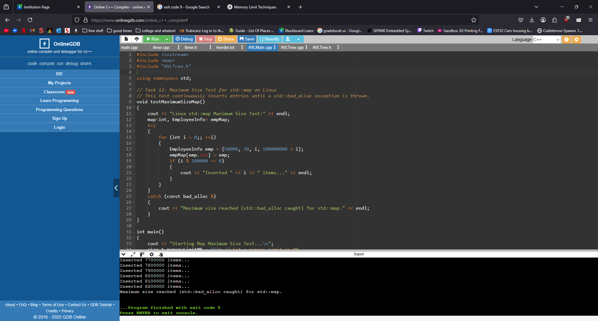
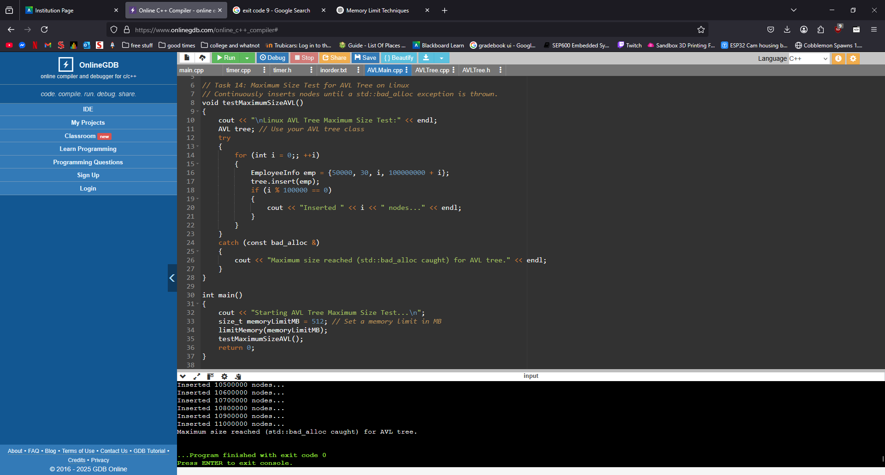
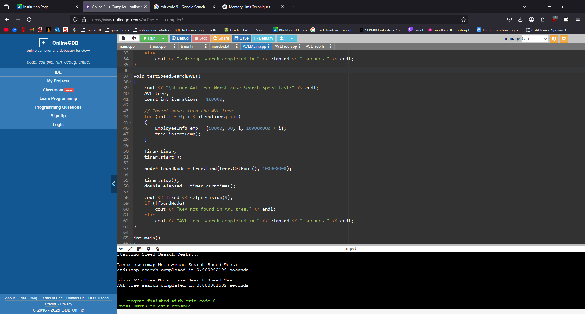

# AVL Tree and Performance Tests

This project contains a C++ implementation of an AVL Tree along with performance tests comparing the AVL Tree against the standard C++ std::map container. The tests measure both maximum size (memory capacity) and worst-case search speed.

## Project Structure

### AVLTree.h / AVLTree.cpp

Contains the AVL Tree class declaration and implementation. The AVL Tree supports standard operations such as insertion, removal, search, and in-order traversal. The implementation also includes functions to perform single and double rotations to maintain tree balance.

### AVLMain.cpp

Contains a main function that can run AVL Tree.

### avlMemtest.cpp, mapMemtest.cpp, speedTest.cpp

These files contain test cases:
**_avlMemtest.cpp_**: Continuously inserts nodes into the AVL tree until a memory allocation error occurs.
**_mapMemtest.cpp_**: Continuously inserts entries into a std::map until a memory allocation error is caught.
**_speedTest.cpp_**: Contains worst-case search speed tests for both std::map and the AVL Tree.

## Makefile

The provided Makefile simplifies the build process for the project. Below is an explanation of its targets:
Targets:

### avlTree:

Builds an executable named avlTree using AVLMain.cpp along with the common source files.

### avlMemtest:

Builds an executable named avlMemtest using avlMemtest.cpp and the common source files. This target runs the maximum size test for the AVL tree.

### mapMemtest:

Builds an executable named mapMemtest using mapMemtest.cpp and the common source files. This target tests maximum size using std::map.

### speedTest:

Builds an executable named speedTest using speedTest.cpp and the common source files. This target runs the worst-case search speed tests for both std::map and the AVL tree.

## How to Build and Run

Build all targets:
Run the following command in your terminal:

**_make all_**

This command compiles all executables defined in the Makefile.

Run a specific test:
To run the AVL Tree memory test:

**_./avlMemtest_**

To run the Map memory test

**_./mapMemTest_**

To run the speed tests:

**_./speedTest_**

# Result

After running the tests, We found that the AVL Tree outperformed the std::map in both memory usage and search speed. The AVL Tree was able to handle more nodes before encountering memory allocation issues and provided faster search times in the worst-case scenarios.

